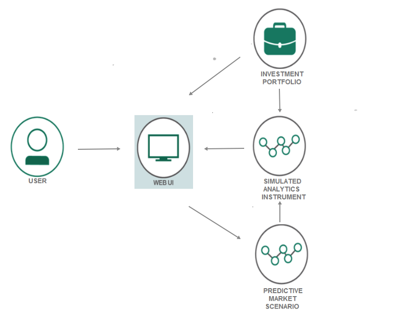

[](https://travis-ci.com/IBM/Predictive-Market-Stress-Testing)
# Predictive Market Stress Testing

In this code pattern, we will use three IBM Cloud finance services to create a web application which performs a stress test on an investment portfolio. The Investment Portfolio service is used to load the portfolio into the interface. The Predictive Market Scenario service will create a scenario csv file using risk factor and shock magnitude from user inputs. The Simulated Instrument Analytics service uses the scenario csv file with each holding in the portfolio to create a table displaying the current and stressed price of the investment holding.

This code pattern is designed for developers with interest in creating financial applications pertaining to investment portfolios.  When the reader has completed this code pattern, they will understand how to:

* Load and retrieve data from the Investment Portfolio service
* Use the Predictive Market Scenario service to generate a scenario
* Send data along with a scenario to the Simulated Instrument Analytics service to retrieve analytics

<p align="center">
  
</p>

## Included Components

Offered on [IBM Cloud](https://cloud.ibm.com/):

+ [Investment Portfolio](https://cloud.ibm.com/catalog/services/investment-portfolio)
+ [Predictive Market Scenario](https://cloud.ibm.com/catalog/services/predictive-market-scenarios)
+ [Simulated Instrument Analytics](https://cloud.ibm.com/catalog/services/predictive-market-scenarios)

**Note:** these services are free for those who have a Lite account

# Deploy to IBM Cloud

Create an [IBM Cloud account](https://cloud.ibm.com/registration/?target=%2Fdashboard%2Fapps) and directly deploy the application using the button bellow.

[](https://cloud.ibm.com/devops/setup/deploy?repository=https://github.com/IBM/Predictive-Market-Stress-Testing)


Be sure to [load investment portfolio](#3-load-investment-portfolio) before running the application.

# Running the Application
Follow these steps to setup and run this code pattern. The steps are described in detail below.

## Prerequisite
- [Python](https://www.python.org/downloads/)
- [curl](https://curl.haxx.se/download.html)
- [IBM Cloud account](https://cloud.ibm.com/registration/?target=%2Fdashboard%2Fapps)
- [IBM Cloud CLI](https://cloud.ibm.com/docs/cli)

## Steps
1. [Clone the repo](#1-clone-the-repo)
2. [Create IBM Cloud services](#2-create-ibm-cloud-services)
3. [Load Investment Portfolio](#3-load-investment-portfolio)
4. [Configure Manifest file](#4-configure-manifest-file)
5. [Configure .env file](#5-configure-env-file)
6. [Run Application](#6-run-application)

## 1. Clone the repo

Clone the `Predictive-Market-Stress-Testing code` locally. In a terminal, run:

  `$ git clone https://github.com/IBM/Predictive-Market-Stress-Testing`


## 2. Create IBM Cloud services

Create the following services in IBM Cloud.  These services are part of either `Free` or `Experimental` plan.

* [**Investment Portfolio**](https://cloud.ibm.com/catalog/services/investment-portfolio)
* [**Predictive Market Scenario**](https://cloud.ibm.com/catalog/services/predictive-market-scenarios)
* [**Simulated Instrument Analytics**](https://cloud.ibm.com/catalog/services/simulated-instrument-analytics)


## 3. Load Investment Portfolio

You can load your Investment Portfolio using curl commands in a terminal.
For all these steps:
- replace {service-user-id} the user id associated with your Investment Portfolio service
- replace {service-user_password} with the password associated with your Investment Portfolio service

**For Mac & Linux**

i. Creating a portfolio entry in your Investment Portfolio service:

`curl -X POST -u "{service-user-id}":"{service-user_password}" --header 'Content-Type: application/json' --header 'Accept: application/json' -d '{ "name":"MyFixedIncomePortfolio", "timestamp": "2017-02-22T19:53:56.830Z", "closed": false, "data": { "manager": "Will Smith" }}' 'https://investment-portfolio.mybluemix.net/api/v1/portfolios'`

ii. Creating holdings in your entry:

`curl -X POST -u "{service-user-id}":"{service-user_password}" --header 'Content-Type: application/json' --header 'Accept:application/json' -d '{ "timestamp": "2017-06-04T19:53:56.830Z", "holdings": [ { "asset": "AMGN 4.1 06/15/21", "quantity": 10, "instrumentId": "CX_US031162BG42_USD", "companyName": "AMGEN INC"}, { "asset": "AMGN 5.15 11/15/41", "quantity": 30, "instrumentId": "CX_US031162BK53_USD", "companyName": "AMGEN INC" }, { "asset": "EVHC 5.625 07/15/22", "quantity": 50, "instrumentId": "CX_US03232PAD06_USD", "companyName": "ENVISION HEALTHCARE CORP"}, { "asset": "APC 4.85 03/15/21", "quantity": 40, "instrumentId": "CX_US032511BM81_USD", "companyName": "ANADARKO PETROLEUM CORP"}, { "asset": "ADI 3.5 12/05/26", "quantity": 30, "instrumentId": "CX_US032654AN54_USD", "companyName": "ANALOG DEVICES INC"}, { "asset": "ABIBB 2.65 02/01/21", "quantity": 20, "instrumentId": "CX_US035242AJ52_USD", "companyName": "ANHEUSER-BUSCH INBEV FIN"}, { "asset": "ABIBB 3.3 02/01/23", "quantity": 10, "instrumentId": "CX_US035242AL09_USD", "companyName": "ANHEUSER-BUSCH INBEV FIN"} ] }' 'https://investment-portfolio.mybluemix.net/api/v1/portfolios/MyFixedIncomePortfolio/holdings'`

Find more information on Investment Portfolio api calls [here](https://cloud.ibm.com/apidocs/751-investment-portfolio?&language=node#introduction).

**For Windows**

For windows, curl commands cannot include single quotes so provide json data as a separate file.

i. For creating a portfolio entry, create a json text file for data and save it i.e `json.txt`
```
{ "name":"MyFixedIncomePortfolio", "timestamp": "2017-02-22T19:53:56.830Z", "closed": false, "data": { "manager": "Will Smith" }}
```

In the same directory as the `json.txt` file, navigate to the folder in `DOS prompt`. And then run then the curl command:
```
curl -X POST -u "{service-user-id}":"{service-user_password}" --header "Content-Type: application/json" --header "Accept: application/json" -d @json.txt https://investment-portfolio.mybluemix.net/api/v1/portfolios
```

ii. Similarly for creating holdings, create a json text file for data i.e `json_holdings.txt`
```
{ "timestamp": "2017-06-04T19:53:56.830Z", "holdings": [ { "asset": "AMGN 4.1 06/15/21", "quantity": 10, "instrumentId": "CX_US031162BG42_USD", "companyName": "AMGEN INC"}, { "asset": "AMGN 5.15 11/15/41", "quantity": 30, "instrumentId": "CX_US031162BK53_USD", "companyName": "AMGEN INC" }, { "asset": "EVHC 5.625 07/15/22", "quantity": 50, "instrumentId": "CX_US03232PAD06_USD", "companyName": "ENVISION HEALTHCARE CORP"}, { "asset": "APC 4.85 03/15/21", "quantity": 40, "instrumentId": "CX_US032511BM81_USD", "companyName": "ANADARKO PETROLEUM CORP"}, { "asset": "ADI 3.5 12/05/26", "quantity": 30, "instrumentId": "CX_US032654AN54_USD", "companyName": "ANALOG DEVICES INC"}, { "asset": "ABIBB 2.65 02/01/21", "quantity": 20, "instrumentId": "CX_US035242AJ52_USD", "companyName": "ANHEUSER-BUSCH INBEV FIN"}, { "asset": "ABIBB 3.3 02/01/23", "quantity": 10, "instrumentId": "CX_US035242AL09_USD", "companyName": "ANHEUSER-BUSCH INBEV FIN"} ] }
```

And next run the curl command:
```
curl -X POST -u "{service-user-id}":"{service-user_password}" --header "Content-Type: application/json" --header "Accept:application/json" -d json_holdings.txt https://investment-portfolio.mybluemix.net/api/v1/portfolios/MyFixedIncomePortfolio/holdings`
```

## 4. Configure Manifest file

Edit the `manifest.yml` file in the folder that contains your code and replace with a unique name for your application. The name that you specify determines the application's URL, such as `your-application-name.mybluemix.net`. Additionally - update the service names so they match what you have in IBM Cloud. The relevant portion of the `manifest.yml` file looks like the following:

  ```none
  declared-services:
    Investment-Portfolio:
      label: fss-portfolio-service
      plan: fss-portfolio-service-free-plan
    Predictive-Market-Scenarios:
      label: fss-predictive-scenario-analytics-service
      plan: fss-predictive-scenario-analytics-service-free-plan
    Simulated-Instrument-Analytics:
      label: fss-scenario-analytics-service
      plan: fss-scenario-analytics-service-free-plan
  applications:
  - path: .
    memory: 128M
    instances: 1
    name: Predictive-Market-Stress-Testing
    disk_quota: 1024M
    domain: mybluemix.net
    services:
    - Investment-Portfolio
    - Predictive-Market-Scenarios
    - Simulated-Instrument-Analytics
    buildpack: python_buildpack
  ```

## 5. Configure .env file

Create a `.env` file in the root directory of your clone of the project repository by copying the sample `.env.example` file using the following command:

  ```none
  cp .env.example .env
  ```

  **NOTE** Most files systems regard files with a "." at the front as hidden files.  If you are on a Windows system, you should be able to use either [GitBash](https://gitforwindows.org/) or [Xcopy](https://docs.microsoft.com/en-us/windows-server/administration/windows-commands/xcopy)

You will need to update the credentials with the IBM Cloud credentials for each of the services you created in [Step 2](#2-create-bluemix-services).

The `.env` file will look something like the following:

  ```none
  #Investment Portfolio
  CRED_PORTFOLIO_USERID_W=
  CRED_PORTFOLIO_PWD_W=
  CRED_PORTFOLIO_USERID_R=
  CRED_PORTFOLIO_PWD_R=
  URL_GET_PORTFOLIO_HOLDINGS=https://investment-portfolio.mybluemix.net/api/v1/portfolios/

  #Predictive Market Scenario
  CRED_PREDICTIVE_MARKET_SCENARIO_URL=https://fss-analytics.mybluemix.net/api/v1/scenario/generate_predictive
  CRED_PREDICTIVE_MARKET_SCENARIO_ACCESSTOKEN=

  #Simulated Instrument Analytics
  CRED_SIMULATED_INSTRUMENT_ANALYTICS_URL=https://fss-analytics.mybluemix.net/api/v1/scenario/instrument/
  CRED_SIMULATED_INSTRUMENT_ANALYTICS_ACCESSTOKEN=
  ```

## 6. Run Application

In your terminal, cd into this project's root directory
+ Run `pip install -r requirements.txt` to install the app's dependencies
+ Run `python run.py`
+ Access the running app in a browser at <http://0.0.0.0:3000/>

You can push the app to IBM Cloud using [IBM Cloud CLI](https://cloud.ibm.com/docs/cli). This will use the services and application name in the `manifest.yml` file.  From your root directory login into IBM Cloud using CLI:
```
bx login
```
And push the app to IBM Cloud:
```
bx push
```

# Troubleshooting

* To troubleshoot your IBM Cloud application, use the logs. To see the logs, run:

```bash
bx logs <application-name> --recent
```

* If you are running locally - inspect your environment variables closely to confirm they match.  Try running each service as standalone:

```bash
python InvestmentPortfolio.py
python PredictiveMarketScenario.py
python SimulatedInstrumentAnalytics.py
```

* If you receive ssl error running curl commands try `curl --insecure` which removes certificate verification


# License

This code pattern is licensed under the Apache Software License, Version 2.  Separate third party code objects invoked within this code pattern are licensed by their respective providers pursuant to their own separate licenses. Contributions are subject to the [Developer Certificate of Origin, Version 1.1 (DCO)](https://developercertificate.org/) and the [Apache Software License, Version 2](https://www.apache.org/licenses/LICENSE-2.0.txt).

[Apache Software License (ASL) FAQ](https://www.apache.org/foundation/license-faq.html#WhatDoesItMEAN)
